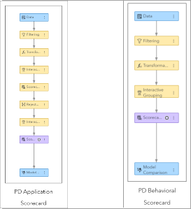

# A n00b’s Guide to Decrypting Credit Scoring

## Introduction

Delving into credit scores - the ultimate puzzle in personal finance that wields more influence over
our lives than we would like to admit.

## The Origins of Confusion

- The credit score aims to gauge how reliable you are at repaying borrowed money;
- Being financially responsible doesn’t always make you a favorite with lenders;
- Your score takes a slight hit just because you dared to take a peek - check your credit score out
of curiosity;
- Let's study how they have the power to make even the calmest among us anxious.

## History of Credit Scoring

- The basic idea involves identifying key factors that influence the probability of default (PD) and
combining or weighting them into a quantitative score, which can be interpreted directly or used as
a basis of **classification system**;
- Ronald Fisher and his introduction of *discriminant analysis* in the 1930s;
- Then World War II, "rules of thumb" for military officers;
- 1960s: power of credit scoring dominated any judgment-based methods;
- 1980s: **logistic regression** was widely used, experts system and neural networks were
experimented. Usage extended to retention, attrition, collections, insurance, and other fields.

## The Mechanics of Calculating Scores

Probability estimates of **delinquency**, derived from **statistical models** that correlate credit
report data (among other things) with **past debt performance**.

### I. The Data

- Credit report data offers a detailed snapshot of an individual's financial behavior and credit
history, compiled by credit bureaus;
- Encompasses personal details, including name and national identification number;
- Tracks payment patterns, highlighting any late or missed payments, bankruptcies and liens;
- Lists credit inquiries;
- Incorporates alternative data points like social media engagement, mobile phone usage.
- Uses all *legally permissible information available*, varies on jurisdictions.

### II. The Appropriate Variables

- Credit scoring is not exactly science: although bases on **sophisticated statistical models**,
but involves a level of estimation and uncertainty. It's nature of the world!;
- Predictive predictors:  frequency of hard inquiries, absence of credit cards, high credit
utilization, or multiple credit applications, etc..., show high **correlation** to delinquency;
- **Correlation is not causation**, predictors don't guarantee default on an **individual basis**;
- Target variable: $Y$ - normally is PD - probability of default - usually binary (`0/1`) or ordinal
(risk grades);
- Predictors: $X$ - chosen based on their predictive power, stability, and logical relationship to
credit risk - payment history, credit utilization, length of credit history, types of credit
accounts, and recent credit inquiries, utility payments, or social media data;
- **Compliance**!

### III. Binning, Weight of Evidence (WOE), and Information Value (IV)

- **Binning** is the method of dividing continuous or categorical variables into distinct intervals
or group, helps *simplify data*, *manage outliers*, and *reduce noise*, *identify complex*,
*non-linear patterns*;
- **Information Value (IV)** indicates the predictive strength of a variable, and is calculated by
assigning a Weight of Evidence (WOE) to each bin and summing these WOE values, weighted by the
difference in the distribution of good and bad cases.

### IV. Models

- **Expert systems**: pre-defined rules;
- **Logistic regression**: robustness, user-friendliness, and clarity in interpretation:
  
$\ln \left(\frac{\text{Pr}(\text{Default} = \text{Yes})}{\text{Pr}(\text{Default} =
\text{No})}\right) = \beta_0 + \beta_1 \cdot X_1 + \beta_2 \cdot X_2 + \cdots +
\beta_k \cdot X_k + \epsilon$

with $X$ is variables after *WOE encoded*.

### V. Log Odds, Scaling, and Scorecards

- **Log odds** are the natural logarithm of the odds of an event occurring:
  - probability of default $p$;
  - the odds of defaulting are calculated as $p/(1−p)$;
  - the log odds are expressed as $\ln(p/(1−p))$;
- Logistic regression models produce log odds directly, which are then transformed into more
intuitive and usable credit scores;
- **Scaling** is the process of converting log odds into a credit score that ranges within a
predefined scale (using linear transformation).

### VI. Which log odds to use?

The formula typically uses the log odds of *not defaulting to defaulting*, even though popular
models like logistic regression will directly output the log odds of *defaulting to not defaulting*:

$\ln(\frac{1-p}{p})$

where $p$ if probability of default, the lower $p$, the higher score, intuitively!

The transformation to employ the scores is:

$Score = offset + Factor * \ln(\frac{1-p}{p})$

where the $offset$ aka *Base Score* is simply constant. We can obtain $offset$ and $Factor$ in 2
ways:

#### Method I

$\text{Offset} = \frac{\text{Ref Score} \cdot \ln(\text{Ref Odds} \cdot \text{Odds Inc}) -
(\text{Ref Score} + \text{Score Inc}) \cdot \ln(\text{Ref Odds})}{\ln(\text{Odds Inc})}$

and

$Factor = \frac{PDO}{\ln(Odds Inc)}$

where:

- **Ref Score** = Reference Score associated with a given Ref Odds
- **Ref Odds** = Reference Odds associated with a given Ref Score
- **Odds Inc** = Reference Odds Increment. In our situation this will be 2, given that we specify the score points required to double the odds.
- **Score Inc** = Score Increment
- **PDO** = The number of points required for the odds to double.

For eg., with $Ref Score = 200$, $Ref Odds = 50$ and $PDO = 20$, $Odds Inc = 2$:

$offset = \frac{200 \cdot \ln(50 \cdot 2) - (200 + 20) \cdot \ln(50)}{\ln(2)}$

$offset = \frac{200 \cdot 4.605 - 220 \cdot 3.912}{0.693} = \frac{921 - 860.64}{0.693} = \frac{60.36}{0.693} = 87.099 \approx 87.1$

and

$Factor = \frac{20}{0.693} \approx 28.86$

> **Therefore, a score of 200 corresponds to the odds 50:1 of being a good client, and a score of 220 corresponds to the odds 100:1 of being a good client.**

#### Method II

Using the fact that:

$200 = offset + Factor * \ln(\frac{50}{1})$

and

$220 = offset + Factor * \ln(\frac{1000}{1})$

We have:

$20 = Factor[\ln(100) - \ln(50)]$, thus
$Factor = \frac{20}{\ln(2)} \approx 28.86$

and

$offset = 200 - Factor * \ln(50) = 200 - 28.86 * 3.912 \approx 87.1$

### VII. Allocation to Attibute Points

The next important question is how do we distribute the overall credit score across various attributes?
Assume only two attributes that determine credit scores, and these are **Payment History**, and **Credit History**. And
we are using *logitstic regression.

$\text{odds ratio} = \frac{\text{odds of a specific bin}}{\text{odds of the reference bin}}$

equivalent to:

$\text{odds of the reference bin} = \text{odds ratio} * \text{odds of a specific bin}$

| Attribute | Bin | β-Estimates | Odds Ratios | Odds $(p/(1-p))$ | Ref Odds | $(1-p)/p$ | $Ln((1-p)/p)$ | Assigned Points (rounded) |
|:----------|:----|:------------|:------------|:---------------|:---------|:---------|:-------------|:-------------------------|
| Payment History | 0 late payments | -2.0 | 0.135 | 0.135*0.05=0.007 | 0.05 | 142.86 | 4.962 | 87.1+28.86*4.962=230 |
| | 1-2 late payments | -0.5 | 0.607 | 0.607*0.05=0.0304 | 0.05 | 32.89 | 3.498 | 87.1+28.86*3.498=188 |
| | 3+ late payments | 1.0 | 2.718 | 2.718*0.05=0.1359 | 0.05 | 7.36 | 1.996 | 87.1+28.86*1.996=145 |
| Credit History | 0-4 years | 1.5 | 4.482 | 4.482*0.05=0.2241 | 0.05 | 4.462 | 1.496 | 87.1+28.86*1.496=130 |
| | 5-9 years | 0.2 | 1.22 | 1.22*0.05=0.061 | 0.05 | 16.39 | 2.797 | 87.1+28.86*2.797=168 |
| | 10+ years | -1.2 | 0.301 | 0.301*0.05=0.0151 | 0.05 | 66.23 | 4.193 | 87.1+28.86*4.193=208 |

Note: Reference odds is assumed to be 0.05; offset=87.1, factor=28.86

For eg.:

| Attribute | Bin | Score Points |
|:----------|:---------|:------------|
| Payment History | 1-2 late payments | 188 |
| Credit History | 0-4 years | 130 |
| Final Credit Score | | 318 |

## Mainstream of Scorecard Vendors

| Vendor | Reference Score | Reference Odds | PDO |
|:--------|:----------------|:---------------|:-----|
| FICO | 600 or 660 | 10:1 or 20:1 | 20 |
| Experian | 660 | 20:1 | 20 |
| Equifax | 600 | 10:1 or 20:1 | 20 |

## Bonus: building Scorecards in SAS Model Studio

## Sources

1. SAS Commumity: <https://communities.sas.com/t5/SAS-Communities-Library/A-n00b-s-Guide-to-Decrypting-Credit-Scoring/ta-p/943475>;
2. StackExchange: <https://stats.stackexchange.com/questions/504883/how-to-convert-coefficients-of-logistic-regression-into-score-values-when-constr>.
