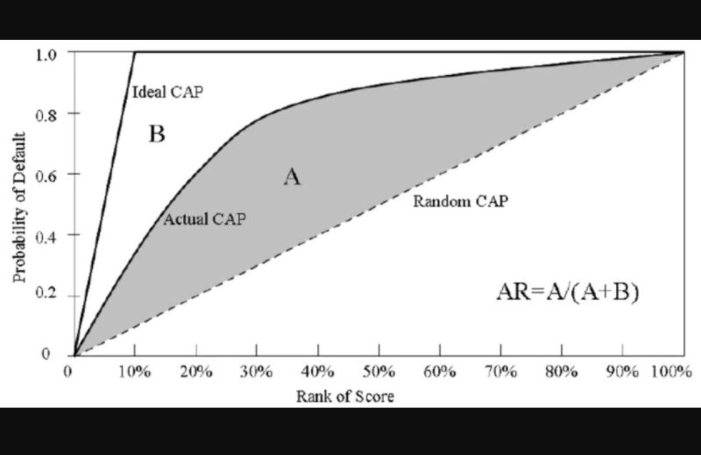

# Credit Risk Modeling: Model Risk And What To Look Out For

When it comes to validating credit risk models, there are some who view validation as nothing more than replication work and statistical testing. There is a lot more to reviewing credit risk models than pure replication and p-values.

A model reviewer should be able to tell if the model is going in the right direction by looking at a few things, before even going into details, down to the data.



1. The **data profile**, how much history, how many variables were considered etc.

    ```python
    import pandas as pd
    import numpy as np

    def validate_data_profile(df):
        """
        Validate data profile characteristics for credit risk modeling
        
        Parameters:
        df (pd.DataFrame): Input dataset
        
        Returns:
        dict: Validation results and insights
        """
        profile_results = {
            'total_records': len(df),
            'total_features': len(df.columns),
            'historical_depth': None,
            'missing_data_percentage': {},
            'data_profile_issues': []
        }
        
        # Check historical depth
        if 'origination_date' in df.columns:
            profile_results['historical_depth'] = (
                pd.Timestamp.now() - df['origination_date'].min()
            ).days / 365.25
        
        # Check missing data
        for column in df.columns:
            missing_pct = df[column].isna().mean() * 100
            profile_results['missing_data_percentage'][column] = missing_pct
            
            if missing_pct > 20:
                profile_results['data_profile_issues'].append(
                    f"High missing data in {column}: {missing_pct:.2f}%"
                )
        
        # Minimum recommended historical depth
        if profile_results['historical_depth'] and profile_results['historical_depth'] < 3:
            profile_results['data_profile_issues'].append(
                f"Historical depth too short: {profile_results['historical_depth']:.2f} years"
            )
        
        return profile_results

    # Example usage
    data = pd.DataFrame({
        'loan_id': range(1000),
        'origination_date': pd.date_range(end=pd.Timestamp.now(), periods=1000),
        'loan_amount': np.random.uniform(1000, 50000, 1000),
        'credit_score': np.random.uniform(500, 800, 1000)
    })

    validation_results = validate_data_profile(data)
    print(validation_results)
    ```

2. The **default definition**, or bad definition. How bads are defined, what is considered "performing" and anything in between (indeterminate cases).

    ```python
    def validate_default_definition(df, default_threshold=90):
    """
    Validate default/bad loan definition and characteristics
    
    Parameters:
    df (pd.DataFrame): Input dataset
    default_threshold (int): Days past due to consider as default
    
    Returns:
    dict: Default definition validation results
    """
    validation_results = {
        'total_loans': len(df),
        'default_count': 0,
        'default_rate': 0,
        'default_characteristics': {}
    }
    
    # Assume columns: days_past_due, loan_status, default_flag
    if 'days_past_due' in df.columns:
        defaults = df[df['days_past_due'] >= default_threshold]
        validation_results['default_count'] = len(defaults)
        validation_results['default_rate'] = len(defaults) / len(df) * 100
        
        # Analyze default characteristics
        validation_results['default_characteristics'] = {
            'avg_loan_amount': defaults['loan_amount'].mean(),
            'avg_credit_score': defaults['credit_score'].mean(),
            'default_distribution': defaults['loan_status'].value_counts(normalize=True)
        }
    
    # Check if default rate is within reasonable bounds
    if validation_results['default_rate'] > 10 or validation_results['default_rate'] < 1:
        validation_results['warning'] = "Unusual default rate detected"
    
    return validation_results

    # Example usage
    data = pd.DataFrame({
        'loan_id': range(1000),
        'days_past_due': np.random.randint(0, 180, 1000),
        'loan_amount': np.random.uniform(1000, 50000, 1000),
        'credit_score': np.random.uniform(500, 800, 1000),
        'loan_status': np.random.choice(['Active', 'Defaulted', 'Charged Off'], 1000)
    })

    default_validation = validate_default_definition(data)
    print(default_validation)
    ```

3. The **segments of the model**. Like probability of default PD model, may be segmented by time on book (months on book MOB) i.e new to bank (MOB < 6 months etc), existing to bank, new to bureau etc. Segments may make use of application scores A-scores, behaviour scores B-scores. What analysis is performed to get appropriate segments.

    ```python
    def validate_model_segments(df):
        """
        Validate model segmentation strategy
        
        Parameters:
        df (pd.DataFrame): Input dataset with segmentation features
        
        Returns:
        dict: Segmentation validation results
        """
        # Assume columns: months_on_book, customer_type, application_score
        segmentation_results = {
            'segments': {},
            'segment_performance': {},
            'segment_validation_issues': []
        }
        
        # Define segments
        segments = {
            'new_to_bank': df[df['months_on_book'] < 6],
            'existing_to_bank': df[df['months_on_book'] >= 6],
            'a_score_high': df[df['application_score'] >= 700],
            'a_score_low': df[df['application_score'] < 700]
        }
        
        # Analyze each segment
        for segment_name, segment_data in segments.items():
            if len(segment_data) == 0:
                segmentation_results['segment_validation_issues'].append(
                    f"Empty segment: {segment_name}"
                )
                continue
            
            segmentation_results['segments'][segment_name] = len(segment_data)
            
            # Segment performance metrics
            segmentation_results['segment_performance'][segment_name] = {
                'avg_credit_score': segment_data['credit_score'].mean(),
                'default_rate': (segment_data['days_past_due'] >= 90).mean() * 100
            }
        
        # Check segment balance
        total_loans = len(df)
        for segment, count in segmentation_results['segments'].items():
            segment_percentage = count / total_loans * 100
            if segment_percentage < 5 or segment_percentage > 80:
                segmentation_results['segment_validation_issues'].append(
                    f"Imbalanced segment: {segment} - {segment_percentage:.2f}%"
                )
        
        return segmentation_results

    # Example usage
    data = pd.DataFrame({
        'loan_id': range(1000),
        'months_on_book': np.random.randint(0, 24, 1000),
        'customer_type': np.random.choice(['New', 'Existing'], 1000),
        'application_score': np.random.uniform(500, 800, 1000),
        'credit_score': np.random.uniform(500, 800, 1000),
        'days_past_due': np.random.randint(0, 180, 1000)
    })

    segment_validation = validate_model_segments(data)
    print(segment_validation)
    ```

4. Model **discrimination testing**.

   - Discrimination here refers to the model output prediction's ability to distinguish the bad borrowers from performing borrowers.
   - For PD usually, measured by the Gini coefficient, or so-called Accuracy Ratio AR.
   - High or relatively low AR, what is acceptable. The intuition.

    ```python
    import numpy as np
    import pandas as pd
    from sklearn.metrics import roc_auc_score

    def calculate_gini_coefficient(y_true, y_pred):
        """
        Calculate Gini coefficient (Accuracy Ratio)
        
        Parameters:
        y_true (array): Actual default status
        y_pred (array): Predicted probabilities
        
        Returns:
        float: Gini coefficient
        """
        # Area Under ROC Curve
        auc = roc_auc_score(y_true, y_pred)
        
        # Gini = 2 * (AUC - 0.5)
        gini = 2 * (auc - 0.5)
        
        return gini

    def validate_model_discrimination(df, prediction_column, default_column):
        """
        Validate model discrimination power
        
        Parameters:
        df (pd.DataFrame): Dataset with predictions and actual defaults
        prediction_column (str): Column with prediction probabilities
        default_column (str): Column indicating default status
        
        Returns:
        dict: Discrimination validation results
        """
        discrimination_results = {
            'gini_coefficient': None,
            'discrimination_power': None,
            'discrimination_assessment': None
        }
        
        # Calculate Gini coefficient
        gini = calculate_gini_coefficient(
            df[default_column], 
            df[prediction_column]
        )
        
        discrimination_results['gini_coefficient'] = gini
        
        # Interpret Gini coefficient
        if gini < 0.4:
            discrimination_results['discrimination_power'] = 'Poor'
            discrimination_results['discrimination_assessment'] = 'Model lacks ability to distinguish defaults'
        elif gini < 0.6:
            discrimination_results['discrimination_power'] = 'Weak'
            discrimination_results['discrimination_assessment'] = 'Moderate discrimination capability'
        elif gini < 0.8:
            discrimination_results['discrimination_power'] = 'Good'
            discrimination_results['discrimination_assessment'] = 'Strong model discrimination'
        else:
            discrimination_results['discrimination_power'] = 'Excellent'
            discrimination_results['discrimination_assessment'] = 'Exceptional model discrimination'
        
        return discrimination_results

    # Example usage
    np.random.seed(42)
    data = pd.DataFrame({
        'prediction_prob': np.random.uniform(0, 1, 1000),
        'actual_default': np.random.choice([0, 1], 1000, p=[0.9, 0.1])
    })

    discrimination_validation = validate_model_discrimination(
        data, 
        'prediction_prob', 
        'actual_default'
    )
    print(discrimination_validation)
    ```

5. Model **calibration**

   - Models must be calibrated.
   - For PD models, review how the central tendency CT is determined. How is the long run PD set? What were the downturn years. Is there a mix of high and low ODRs, and any margin of conservatism.
   - For LGD, EAD, similarly, what are the downturn years. Are actual losses truly peaking in those years.
   - Is segment level calibration necessary? Like segment level CT? Why or why not.

    ```python
    import numpy as np
    import pandas as pd
    import scipy.stats as stats

    def validate_model_calibration(df, predicted_pd_column, actual_default_column):
        """
        Validate model calibration for Probability of Default (PD)
        
        Parameters:
        df (pd.DataFrame): Dataset with predicted and actual defaults
        predicted_pd_column (str): Column with predicted PD
        actual_default_column (str): Column indicating actual default
        
        Returns:
        dict: Calibration validation results
        """
        calibration_results = {
            'average_predicted_pd': df[predicted_pd_column].mean(),
            'observed_default_rate': df[actual_default_column].mean(),
            'calibration_metrics': {},
            'calibration_assessment': None
        }
        
        # Hosmer-Lemeshow Goodness of Fit Test
        deciles = pd.qcut(df[predicted_pd_column], q=10, labels=False)
        grouped = df.groupby(deciles)
        
        hosmer_lemeshow_results = {
            'expected_defaults': [],
            'observed_defaults': [],
            'chi_square_statistic': None,
            'p_value': None
        }
        
        for name, group in grouped:
            expected_defaults = group[predicted_pd_column].mean() * len(group)
            observed_defaults = group[actual_default_column].sum()
            
            hosmer_lemeshow_results['expected_defaults'].append(expected_defaults)
            hosmer_lemeshow_results['observed_defaults'].append(observed_defaults)
        
        # Calculate Chi-square statistic
        chi_square_statistic, p_value = stats.chisquare(
            hosmer_lemeshow_results['observed_defaults'], 
            hosmer_lemeshow_results['expected_defaults']
        )
        
        hosmer_lemeshow_results['chi_square_statistic'] = chi_square_statistic
        hosmer_lemeshow_results['p_value'] = p_value
        
        calibration_results['calibration_metrics'] = hosmer_lemeshow_results
        
        # Calibration Assessment
        diff = abs(calibration_results['average_predicted_pd'] - calibration_results['observed_default_rate'])
        
        if diff < 0.01:
            calibration_results['calibration_assessment'] = 'Excellent Calibration'
        elif diff < 0.05:
            calibration_results['calibration_assessment'] = 'Good Calibration'
        elif diff < 0.1:
            calibration_results['calibration_assessment'] = 'Moderate Calibration Issue'
        else:
            calibration_results['calibration_assessment'] = 'Poor Calibration'
        
        return calibration_results

    # Example usage
    np.random.seed(42)
    data = pd.DataFrame({
        'predicted_pd': np.random.uniform(0, 1, 1000),
        'actual_default': np.random.choice([0, 1], 1000, p=[0.9, 0.1])
    })

    calibration_validation = validate_model_calibration(
        data, 
        'predicted_pd', 
        'actual_default'
    )
    print(calibration_validation)
    ```

6. **Calibration** test (or test for conservatism)

   - PD, for newly developed models, the average PD shouldn't be too close to the ODR. Or even breaching it. It indicates under-calibration or something amiss with cyclicality. It doesn't look good to regulators when seeking approval.
   - Similarly for LGD / EAD, at the time of seeking approval, shouldn't have under-calibration.

7. Last but not least. The credit intuition behind each model. Each variable. Each segment. Some credit sense.

These few areas, a model reviewer should be able to tell much about the model. And provide sufficient effective challenge if required. During a full fledged review, of course then replication comes in, to inspect the granular data. Inspecting all the various steps like Single Factor Analysis SFA, Multi Factor Analysis MFA etc.

However before even going there, if the data profile, definition of bads, or segments, or CT looks amiss or lacks justification, or if the calibration is inadequate, it should be highlighted.

Not necessarily a total failure of the model but any breaking points, risks to be addressed.

Of course, we have the all powerful Margin of Conservatism (MoC). Just slap on some.

## Ref

- <https://www.linkedin.com/posts/gabriel-ryan-frm-ba304915_credit-risk-modeling-model-risk-and-what-activity-7300155345815904256-T54g>.
