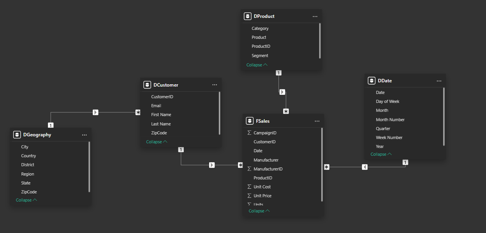

# Master Data Modeling in Power BI by **Pragmatic Works**

## 1. Dimensional Modeling

### 1.1 What is a good Data Model?

1. Can be easily understood and comsumed;
2. Large data changes are scalable;
3. Provide predictable performance;
4. Flexible and adaptable, but not at the expense of the other attributes.

### 1.2 Why build a good Data Model?

A good Data Model make it easier for:

1. Managing Storage Constraints;
2. Performance Tuning;
3. Manageing Row Level Security;
4. Authoring DAX.

### 1.3 From Star Schema to Snowflake

- Star Schema: a **Fact table** surrounded by **Dimension tables**;
- Snowflake: normalization of **Dimension tables** to sub-dimension tables.

### 1.4 Steps to build a Model

1. Conceptual Model: high level, just the names of the **tables**.
2. Logical Model: start to add **columns**;
3. Physical Model: meta data of the tables (column nullables, primary keys, foreign keys, ...) - **not available in PBI**.

### 1.5 Dimensional Model Terms

- Dimensional Model: organizies data so it's easy to retrieve for reporting purposes;
- Fact Table: a fact is an event that may or may not include measures;
  - it's a business process or transaction;
  - for eg.: sales (purchase, return), accounting bookings, phone calls, visits, deliveries, etc;
  - there might be multiple fact tables in your data model;
  - build your fact table at the **lowest level of granularity** (we dont have any idea of what question is going to be asked in the future, so be prepared);
  - normally long;
- Dimension Table: Category of information, or a noun, descriptive;
  - contains descriptive attributes that define exactly how the fact table should growth up;
  - privides the `who, what, when, where, why, and how` context surrounding a business process event;
  - normally wide;
  - contains primary/natural keys, surrogate keys (unique ID);
  - best attributes are descriptive;
  - might have start/end date (validated period of the category);
  - or might have flags (True/False);
- Attribute (column in dimension table): descriptor of the object.

### 1.6 Let's practice

- **Conceptual model**:
  - Fact table: `Sales`;
  - Dim tables: `Dim Product`, `Dim Campaign`, `Dim Customer`, `Dim Geography`, `Dim Date`;
- **Logical model**:
  - Select columns for each tables;
  - If the ID is not available: might add indices (in both F & D tables);
  - Go to <https://devinknightsql.com/2015/06/16/creating-a-date-dimension-with-power-query/> and create a `Dim Date` table;
  - It's advisable to create relationship on a `DateKey` rather than a `Date` (for efficiency);
  - If that case, please mark the `Dim Date` as date table and specify the `DateKey` to enable *time intelligence*.

And this is our model:



## 2. Multiple Fact Tables

- Multiple Fact Tables may lead to the original Star Schema model grow to Snowflake table;
- In this scenario, we might could not create a relationship from new fact table to another dim table due to the concerned column may not be primary;
- Now we need to normalize the dim table to another dim table, we need to create "surrogate key";
- We can create custom layouts that show only the table that we concern (around an fact/business process).


## 3. Role Playing Dimension

- When we are concerning multiple aspects of date: order date, shipped date, billed date. How can?;
- 3 ways:
  - create another Power BI reports (not recommended);
  - create multiple `Dim Date` tables to handle different concerns (I will not do this!);
  - create multiple relationships to the `Dim Date` table and manage the **role** (active/inactive, DAX, etc);

The 3rd method:


Now with the **active** relationship from `Order Date` to `Date` and **inactive** from `Ship Date` to `Date`, these 2 measures will give us 2 different views:

```js
// because relationship is active
Total Sales (Order) = SUM(FSales[Sales])


// becausa relationship is inactive
Total Sales (Ship) = CALCULATE(
    [Total Sales (Order)],
    USERELATIONSHIP(
        'FSales'[Ship Date], 'DDate'[Date]
    )
)
```

## 4. Data Analyst of the Future (Fabric ads 😂)

## References

1. Student file: <https://success.pragmaticworks.com/data-modeling-for-power-bi-files?utm_campaign=lwtn-data-modeling-for-power-bi-2024>.
2. Recommened books:
   - The Data Warehouse Toolkit by Ralph Kimball and Margy Ross;
   - Star Schema by Christopher Adamson.
