# **2026**

## **Apr**

::: {.callout-note title="04.24.2026 | Cross-training, from NoGi to Gi" collapse="true"}

Là một người hầu như chỉ tập NoGi từ lúc bắt đầu với Jiu-jitsu, mình cảm thấy khá chật vật khi bắt đầu với bộ gi (đã có gi khoảng 1 năm nhưng có lẽ < 20 sessions tập). Gi là một thế giới mới với pace đánh chậm hơn, "dính" hơn, và vô số các grips (cho phép ta kéo đối thủ với cự li cao hơn).

Có lẽ vì quá lậm grips khi mới tập, mà mình đã push/pull quá nhiều một khi thiết lập được grip, cũng như phản kháng khá aggressive khi bị đối thủ thiết lập tương tự. Cơ bắp rất dễ mệt mỏi, và không hề hiệu quả. Sau đây là một số mindset mà Thong Le có chia sẻ, hi vọng mình có thể dần thay đổi cách tư duy của mình khi đánh với gi:

- Tạo được 1 grip không lợi như bạn nghĩ, hay bị thiết lập grips/guards (lasso, spider) không tệ như bạn nghĩ. Thay vì cố gắng push/pull ngay hay giãy giụa để thoát khỏi grips, hãy tập trung giữ vững base/posture/structure;
- Hãy chấp nhận tính connect liên tục của gi, ít nhất pace đánh chậm cũng cho mình thời gian để suy nghĩ;
- Thay vì tìm kiếm grip break, hãy tìm kiếm *góc để ship lực đi 🚀*, tình trạng stalling kéo dài dù ít dù nhiều cũng sẽ gây mệt mỏi. Hãy tìm một re-direct force từ đối thủ, điều này không chỉ đúng với người đánh bottom, cả người đánh top nữa.

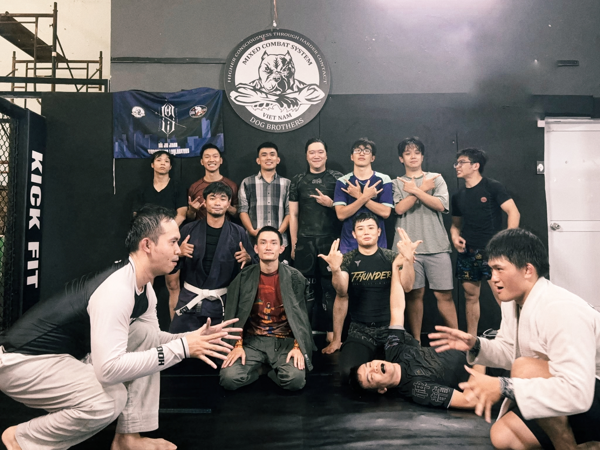

:::

# **2025**

## **November**

::: {.callout-note title="11.26.2025 | Side control" collapse="true"}

Side control, cũng như mount của mình vẫn thường dựa vào quá nhiều hand grip, vì cơ thể ngũ trường và trọng lượng khá nhé. Hôm nay mình được một người anh (có gần như cùng tạng người) chỉ bảo thêm một chút:

- Side control với chest to chest gần như rất khó để tạo ra áp lực (khi gối quỳ), cũng rất khó giữ được sự linh hoạt nếu sprawl chân ra;
- Tuy nhiên vị trí đó luôn sẽ chỉ là tạm thời, ở judo side, ta có thể tạo được áp lực ngay cả với trọng lượng ko quá lớn: sử dụng phần mạn sườn (dưới ngực, dưới cơ liên sườn, dưới cơ xô), pressure lên phần gần xương sườn dưới cùng của bên control. Đưa trọng lượng vào đó (nâng tay và đầu gối lên);
- Transition giữa hai vị trí cần được đảm bảo bằng hand wedging ở phần hông, không cho đối thủ reguard;

Nguyên lý vẫn là P = M / S (áp lực bằng trọng lượng chia diện tích). Ta sẽ tìm 1 điểm nhỏ, đủ cứng, để đặt áp lực lên đó. Tương tự như vậy, ở vị trí turtle, ta cũng sẽ muốn di chuyển trên những đầu ngón chân để tăng áp lực, đồng thời đặt áp lực *chỉ lên 1 vai của đối thủ* mà thôi (thay vì giữa lưng/cột sống). Hiệu quả sẽ tăng lên rõ rệt.

:::

::: {.callout-note title="11.03.2025 | Double under passguard" collapse="true"}

Dù không thường xuyên thực chiến với tình huống này, chúng tôi vẫn nghĩ rằng double under passing là cần cố gắng drive được trọng lượng lên người đối thủ. Rồi sau đó pass qua 1 hướng.

Tuy nhiên sifu đã chỉ ra rằng, chỉ cần đối phương giữ posture và cố di chuyển backward bằng tay, ta sẽ cần lượng lớn sức lực và thậm chí là không pass thành công. Chìa khóa của đòn này chính là làm đốt xương lưng dưới cùng (ngay trên xương cụt) bị **nhấc khỏi mặt đất**. Để làm được điều đó, ta leverage hai đầu gối như 1 cái cầu trượt, dùng tay kéo toàn bộ phần hông của họ lên đó. Lúc đó việc pass sẽ vô dùng dễ dàng.

Phương pháp này cũng được ứng dụng khi ta bị triangle. Hãy kéo hông của đối thủ lên, posture up ~ thẳng lưng, ngước mặt lên trời. Về cơ bản là ta đã có thể thoát được. Thậm chí là rút được tay ra và về lại double under passing.

Happy training! Hôm nay tôi đi làm về muộn mới có thể ghi lại điều này :)

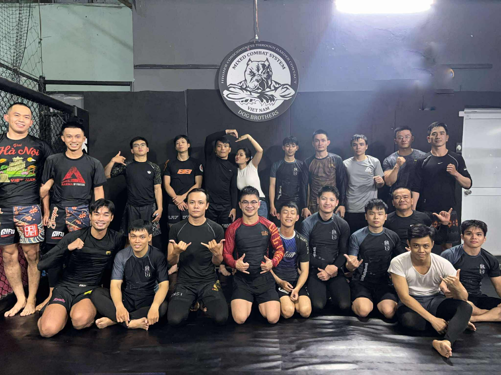

:::

## **October**

::: {.callout-note title="10.25.2025" collapse="true"}

Suýt soát đã hết tháng 10 mà chưa tập được nổi 5 buổi, và cuối tháng sau mình sẽ tham gia một giải phong trào 🙈.

Vừa hay thứ 6 tuần rồi sifu có ghé lò và chúng tôi lại được nghe về gameplan recommendation:

- Hữu hạn lại vị trí của tối thủ mà ta cần quan tâm: đứng, một đầu gối quỳ xuống đất, hai đầu gối quỳ xuống đất. Từ đó đưa ra lựa chọn về guards và hooks;
- Khi ta bottom và đối thủ đứng, connect khuỷu tay và đầu gối (như khi ta đứng để tay về trước đầu gối chống double legs) sẽ giúp ta gurantee được ít nhất 1 guard là shin-to-shin;
- Tất nhiên có nhiều hướng contact khác - hướng được prefer nhất là half guard. Có 1 điểm cần lưu ý ở đây là với half guard, cách tạo áp lực bằng chân là chân trong hook kéo vào, chân shield đẩy ra, như cắt kéo. Concept **push and pull** này được lặp lại rất nhiền trong BJJ: tạo áp lực, làm mất base/posture của đối phương - một ví dụ khác là arm drag - cũng cần nói thêm là tên gọi đúng hơn cho đòn này là shoulder drag;
- Tại đây là có rất nhiều hook chân, tỷ dụ như lockdown, outside lockdown. Mục tiêu ở đây là nuốt được 1 cái chân, làm nó không thể chống được vào sàn;
- Tiếp đến là hình thành thói quen tấn công đồng bộ bằng cả tay và chân. Hai tay và hai chân sẽ chia ra hai nhóm đi săn các mục tiêu. Chúng bổ sợ cho nhau: grip tay và kiểm soát phần vai/đầu làm đối thủ có recover chân. Hook chân tốt sẽ làm họ sập xuống và đưa đến cơ hội tấn công tay. Bổ trợ như vậy nhưng nếu phương thức tấn công **độc lập** với nhau, ko bị ảnh hưởng bởi bên còn lại, thì khả năng tấn công sẽ càng được nâng cao.

Oss!

:::

## **September**

Again lại không viết gì cho tháng 8 rồi, công việc quá bận :<.

::: {.callout-note title="09.19.2025 | Arm/hand locking" collapse="true"}

Lò leglocks chán dạy khóa chân thì làm gì -> dạy arm/hand lock với các kĩ thuật tương đương của leglock :>.

- figure-4 grip có thể giữ vững cấu trúc ngay cả khi bàn tay ta không grip gì cả, chỉ cần gài tay đúng cách. Từ bottom, grip này cho phép ta tiếp cận phần vai - đầu của đối thủ, mở ra các đòn khóa hay sweep (hip bump, scissor);
- đã từng được học về RNC-like foot locking, chúng tôi áp dụng nó với tay - tôi không biết gọi đó là gì nữa. Tay là một chi nhỏ hơn nhiều, vì thế để giữ được grip này, ta cần liên tục cố gắng pivot phương cẳng tay của đối thủ. Grip này cho ta thêm thời gian để quấy phá bằng chân, tìm kiếm các cơ hội tấn công khác.

Quote of the day: *Giờ người ta đánh nhau bằng logistics cả, thằng nào hết xăng trước thằng đó thua*.

Jiu-jitsu là game mà bạn cần, *phân bổ* và *sắp đặt*:

- vị trí cơ thể và các chi của cơ thể trong không gian (liên quan đến base, posture, frame, etc);
- sức mạnh bùng phát (bạn không thể exert lực trên mọi phương hướng);
- cardio (theo dòng thời gian).

Chi bị cô lập và đưa vào nguy hiểm hay hết gas trước khi thời gian kết thúc đều sẽ làm bạn thất thế.

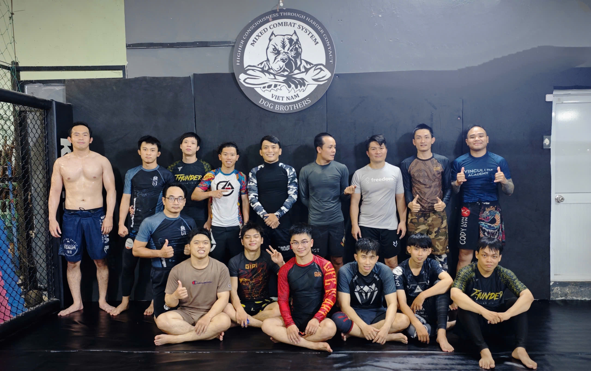

:::

## **July**

::: {.callout-note title="07.09.2025 | Reactive game plan" collapse="true"}

Đã lâu thầy mới ghé lò 🐧, thầy Sói vẫn nhắc lại về tư duy tập luyện như đã từng trước đây, có bổ sung vài thứ, xin re-cap tại đây:

1. Hãy ít quan tâm hơn đến chuyện mình cần đánh đòn nào, làm được gì về mặt kĩ thuật trong tình huống đó;
2. Hãy flow rolling, để cho đối thủ vào được 50% đòn đánh mà họ muốn, rồi bắt đầu phản ứng escape/counter lại;
3. Tư duy chung để react lại của đối thủ vẫn là cố-dán-thật-nhiều-đường-chéo lên người họ. Ta có kiểm soát tốt hơn, có thể hạn chế đòn tấn công và mở ra tình huống có lợi;
4. Nếu ta ngăn chặn đòn đánh từ đầu, họ sẽ kiếm đòn khác. Nếu họ gần như thực hiện thành công, họ sẽ cố thực hiện lại!;
5. Với cơ sở là ta đã biết họ đánh như thế nào, và biết cách thoát ra sao (cũng như cách thoát cho nhiều đòn thế khác - tích lũy qua tập luyện), ta có thể tự tin triển khai lối đánh ngay lúc cần thiết;
6. Mình gọi đó là 'reactive game plan' :">

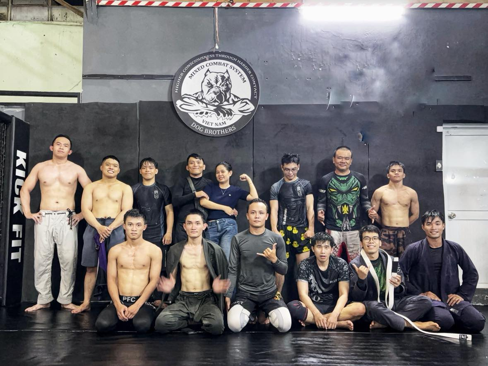

:::

::: {.callout-note title="07.06.2025 | BJJ definition by John Danaher" collapse="true"}

> Lex: Can you explain the fundamentals of Jiu-jitsu?
>
> John: Jiu-jitsu is *art* and *science* which looks to use a combination of tactical and mechanical advantage to focus a very
> high percentage of my strength against a very low percentage of my opponent's strength at a critical point on their body such
> that if I were to exert my strength upon that critical point, they could no longer continue to fight.
>
> Lex: Well, that's about weapons and defenses. But then is there something more to be said about the set of tools that we're
> talking about...?
>
> John: That's where the *art* comes in. Because ultimately, you have a set of choices, and those choices that you make will be
> an act of self-expression on your part. Some will prefer this some will prefer that. That's where you come in as an individual.

Mình nghe [podcast](https://www.youtube.com/watch?v=ktuw6Ow4sd0) của Lex Fridman cùng John Danaher về cách
để master Jiu Jitsu, Grappling, Judo, và MMA.

:::

## **June**

::: {.callout-note title="06.15.2025 | Saigon superfight IV" collapse="true"}

Chúng toi đã tham gia Sài Gòn superfight IV với khoảng 4, 5 trận đấu gì đấy. Anh em đã đều có những trận đấu tốt và học hỏi được thêm nhiều thứ :">

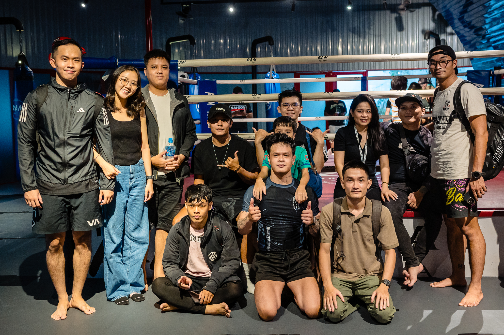

:::

## **May**

There was no note for April haha :">

::: {.callout-note title="05.15.2025 | No rubber guard, no buggy choke" collapse="true"}

Vì yếu thế về thể hình, mình thường xuyên lạm dụng các kỹ thuật giành lại lợi thế từ phía bottom như rubber guard, hay thỉnh thoảng là buggy.

Tuần rồi mình nhận được một lời khuyên, của một người cũng đã tập đủ lâu để nhận ra rằng - các đòn đánh đó come with a cost. Chúng ta sẽ chỉ giành được 1 ít lợi ích nhất định từ đó, tuy nhiên khi tai nạn xảy ra, chúng ta sẽ mất mất rất nhiều. Các đòn này đều rất dễ gây ra các tổn thương đầu gối.

Do đó cái note này có vẻ như sẽ là lời tự cam kết sẽ không sử dụng các kỹ thuật này nữa :)

:::

::: {.callout-note title="05.05.2025 | Lockdown" collapse="true"}

- Lockdown là một thế khóa chân rất hiệu quả trong việc kiểm soát một cách cứng nhắc một chân của đối thủ. Nó hiệu quả khi ngăn cho chúng ta không bị pass guard, nhưng cũng làm chúng ta bế tắc khi hai chân cũng tự khóa cứng;
- Chìa khóa là sự linh hoạt của hông/hip, khi lockdown, chân của chúng ta sẽ dễ dàng đảo theo trục ngang - như con lắc đơn - hơn là co duỗi theo trục dọc. Ta có thể tận dụng nó để làm bánh đà xoay hông;
- Vì thế luôn có hai lựa chọn đặt hông: (1) xoay vào trong như half guard, (2) hoặc xoay ra ngoài tiếp cận lưng của đối thủ;
- Chúng tôi drill lockdown từ những vị trí bị động như (1) khi cố thoát mount, hoặc chủ động như (2) half guard. Mục tiêu của các bài tập vẫn là "Crafting a door", xây dựng thêm một điểm bản lề phía upper - ví dụ chính là vai. Khi đó cùng với bản lề thứ 2 là chân lock down, ta có thể sweep được đối thủ;
- Hôm nay có fighing pant mới hehe - 悟空-黑神话🙊🙉🙈🐵.

:::

## **March**

::: {.callout-note title="03.22.2025 | Crafting a door" collapse="true"}

Mọi kỹ thuật sweep trong Jiu-jitsu đều là hình thái của việc tạo ra một cánh cửa và "mở" nó: tạo và cố định 2 bản lề (**hinges**), sau đó tìm một điểm làm tay nắm cửa (**door handle**). Ví dụ như: X-guard sweep - bạn có thể tưởng tượng ra chứ.

Tuy nhiên trong buổi hôm nay, chúng tôi drill lại butterfly sweep. Sifu muốn nhắc nhở lại rằng sweep đối phương sang hai bên khi ở butterfly guard là
không hiệu quả - vì hai chân của đối phương đang base theo hướng này! Chúng ta cần sweep được đối thủ **qua vai**. Để làm được điều này hãy cố gắng đạt được finger-4 grip trên một tay và chôn nó vào hông đối diện của đối thủ. Lúc này với grip tay là 1 hinge, hook chân tương ứng với tay đó là 1 hinge, còn hook chân còn lại chính là door handle -> ta có thể sweep đối thủ chéo qua vai.

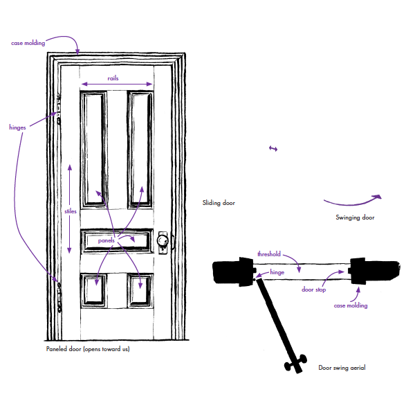

> Quote 1: Khi không thể chống lại một lực từ đối phương, hãy chuyển hướng lực của bạn theo hướng đó (cộng thêm lực của bạn)
> để đạt được một vị trí có lợi hơn. *-- cái này nghe giống Aikido.*

> Quote 2: Trong tập luyện, nên tập theo xu hướng thích nghi và xử lí các tình huống mà đối phương mang đến cho bạn, hơn là áp
> đặt đối phương vào một trạng thái/thế đánh mà mình mong muốn.

:::

::: {.callout-note title="03.08.2025 | Count your opponent's knee" collapse="true"}

Một buổi chiều thứ 7 tôi chống lại sự lười bằng cách xách ba lô lên và đi tập. Lớp 3h chiều cũng gần như chỉ lác đác vài học viên.

Chúng tôi học cách đẩy đối thủ ngã về phía trước từ đòn single leg - bằng chân (với chân còn lại chống xuống đất). Đồng thời cố gắng spin quanh chân bị lock để finish. Chúng tôi tìm kiếm các phương án xử lí khi base của họ quá vững chắc để sweep như: (a) X-guard để dàn trọng tâm ra, (b) chuyển thành reverse single leg, hay (c) ăn sâu chân đối thủ vào hip hơn nữa để tăng khả năng sweep.

Thứ khiến mình suprised nhiều nhất cho buổi học này chính là cách nhìn nhận của sifu trong bottom game: thay vì ghi nhớ guard nào đánh như thế nào, hãy trigger một thói quen đánh khi quan sát một biểu hiện đơn giản hơn của đối thủ - **có mấy đầu gối chạm đất** - một yếu tố quan trọng khi correlate tới position/alignment của đối thủ.

Một model rất dễ vận hành - easy to observe predictors, và hiệu quả rất cao.

> Có bao nhiêu loại guards đi chăng nữa, khi các bạn ở bottom, cũng sẽ chỉ có 3 trường hợp cho đối thủ của bạn:
> (1) hai đầu gối chạm đất, (2) một đầu gối chạm đất, (3) không có đầu gối nào chạm đất.
> Xây dựng gameplan dựa trên ba hình thái này hoàn toàn đơn giản hơn nhiều so với việc memorizing all guard techniques.
> *Vu Dinh Tien - trích tương đối*.

1. Đối thủ có 1 base rất chắc chắn, trọng tâm thấp: đánh tay, cố gắng lấy overhook từ đó đạt được sweep hoặc backtake;
2. Đối thủ có sự cân bằng giữa base và flexibility: xu hướng của sifu sẽ là hook chân (như mọi bài đánh chân khác) vào cái chân quỳ, hai tay sẽ đánh chân còn lại và tiến tới sweep;
3. Single leg, SL-X, reverse single leg takedown: hướng tới sweep và leglock cho trường hợp này.

:::

## **February**

::: {.callout-note title="02.21.2025 | Attention is all you need" collapse="true"}

Chúng tôi chú ý tới các tiểu tiết (nhưng quan trọng) nhiều hơn khi thực hiện đòn ankle lock:

1. Luôn giữ áp lực và đe dọa khi slide vào vị trí single leg;
2. Hai chân kẹp chặt với mục tiêu cố định đầu gối;
3. Hãy luyện tập phản xạ dùng một tay (không phải tay dùng để leg lock) giữ gót đối phương và đưa nó vào armpit;
4. Hãy làm cong đầu gối: khi chân đối phương thẳng, ta đang bẻ cả trục chân của đối phương. Khi đầu gối cong, khớp gối tự nhiên sẽ thành một đầu khóa và đòn khóa chân sẽ hiệu quả hơn;
5. Không ankle lock bằng lực siết tay, mà bằng cách đẩy hông ra phía trước.

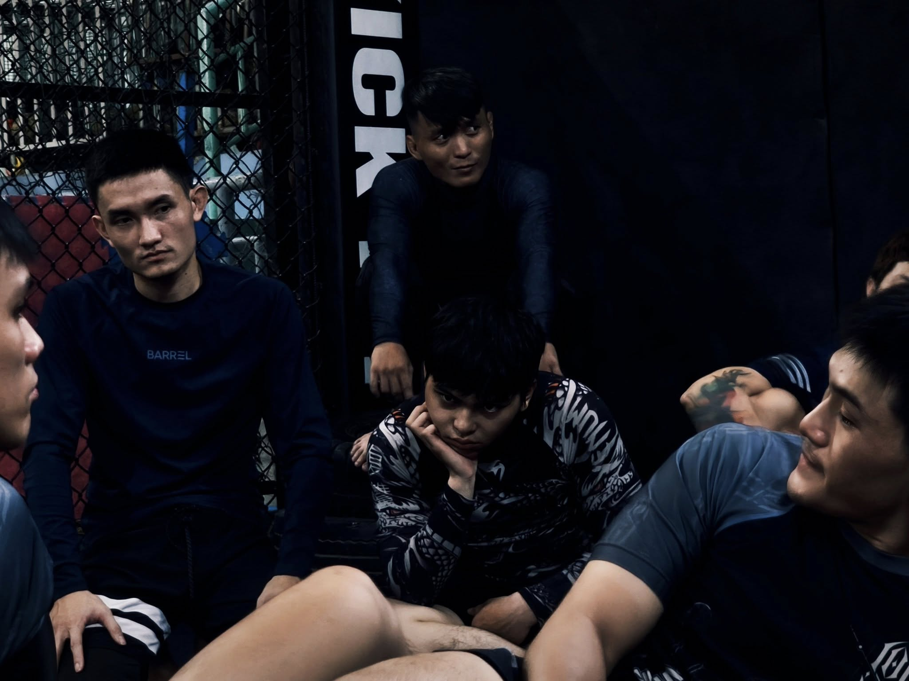

:::

::: {.callout-note title="02.19.2025 | Heel hook" collapse="true"}

Liên tiếp là các bài học về đánh chân:

1. Từ vị trí ankle lock kiểu truyền thống đã học hôm trước, ta có thể chuyển qua kiểu hiện đoạn. Spin quanh trục chân (luôn giữ áp lực) để tìm cơ hội grab luôn chân còn lại của đối thủ. Từ đó:
    - Vẫn có thể tiếp tục ankle lock cái chân đang giữ, tuy nhiên tỷ lệ thoát khá cao;
    - Ta sẽ không quá commit và ngay khi đối thủ cố thoát một chân, ta có thể heel hook chân còn lại.
2. Việc thực hiện đúng các setup khi heel hook cũng quan trọng như việc giữ được nó khi đối thủ cố thoát bằng cách roll/spin. Ta cần follow up.
3. Có hai lựa chọn đánh heel hook khi đang pass guard đối thủ.

:::

::: {.callout-note title="02.17.2025 | The first leg-lock lesson" collapse="true"}

Sau Tết quá lười, mãi tới hôm nay mình mới đi tập được buổi thứ 2 (hôm đầu lười viết 😊). Hôm nay lần đầu tiên mình được dạy một đòn leg submission ở Lò - **ankle lock** - đòn khóa mắt cá chân, thứ được xem là signature của Sói Jiu-jitsu.

Pipeline để đạt được vị trí này vẫn là bài học quen thuộc: **single leg** -> **x-guard** -> **sweep**. Tuy nhiên lần này ta không cố gắng sit up trước đối thủ để giành lấy lợi thế khi pass guard, mà setup lại vị trí single leg - *ở vị trí cả 2 cùng nằm*. Bây giờ có mấy điểm quan trọng cần ghi nhớ sau:

1. Phải cố định được đầu gối và làm gập chân đối thủ: Như single leg, ta ở tư thế *ôm gấu bông*, dùng hai chân kẹp để giữ chặt đầu gối đối thủ. Thêm nữa, nếu chân của họ thẳng, phần cổ chân sẽ rất khỏe, ta cần làm gập nó;
2. Dùng tay lock cổ chân của đối phương vào armpit: Siết tay vừa phải và ngả tay ra sau cho tới khi cảm nhận được gót + mu bàn chân đối thủ.

Để finish, nằm nghiêng xuống, giấu vai đi, đẩy bụng vào.

Mình thực hiện không mượt mà lắm. Sẽ cần luyện tập nhiều hơn.

Đọc thêm về Ankle Lock: <https://bjjfanatics.com/blogs/news/ankle-lock-bjj>. Happy training!

:::

## **January**

::: {.callout-note title="01.08.2025 | Stand up and fight, pal!" collapse="true"}

Cách đây hàng chục triệu cho tới hàng triệu năm, trong kỷ Neogene (23-2.58 mya), cụ thể là trong thời kỳ Miocene muộn và Pliocene, tổ tiên của loài người đã - *lần đầu tiên* - phát triển khả năng **lưỡng cự - bipedalism**, tức đi bằng hai chân.

Hôm nay, sau gần một năm lăn lê bò trườn lộn dưới mặt đất, mình *lần đầu tiên* thấy sư phụ dạy **đánh đứng** - what an evolution!

](img/20250108_evolution.jpeg)

Là một buổi học đơn giản - chúng tôi luyện tập cách xử lí cơ bản khi bị đối thủ **collar tie** hoặc **neck tie** - một phần trong **hand fighting**:

1. Thế tấn: cánh tay đối thủ dùng để neck tie thường ứng với chân đứng sau;
2. Ta dùng tay tương ứng để grip (nghĩa là tay trái - tay trái - chúng sẽ nằm chéo khi hai người đối diện);
3. Tuy nhiên không dùng lực tay để phá neck tie, thay vào đó **đưa vai lên cao, backstep chữ L - pivot $90\degree$ về sau lưng**, tay grip chỉ cần giữ. Áp lực từ vai chúng ta vào cổ tay đối thủ sẽ làm việc;
4. Nó tự nhiên sẽ cho ta 1 vị trí tay **2 đánh 1**, kiểu figure 4, lúc đó ta chỉ cần đơn giản là sit down - on our knees, là đã có thể kéo đối thủ xuống. Một cách tự nhiên, khi chúng ta đưa tay còn lại móc vào hướng chân xa của đối thủ, ta sẽ luôn có được 1 trong các kiểm soát sau:
    - Nếu chân xa ở phạm vi gần, ta có thể **pick vào bắp chân** và sweep;
    - Nếu không móc vào được chân, ta có khả năng sẽ móc được vào armpit. Lúc này với việc circle 2 tay, ta có thể kiểm soát **cả hai tay** đối phương. Vì chỉ còn trụ bằng hai chân, đối thủ sẽ dễ bị kéo ngã về **phía trước**. Di chuyển linh hoạt và lấy side control;
    - Nếu hụt mất armpit, ta có thể móc vào cổ đối phương, kết nối hai tay và circle, ta có được **anaconda grip**, ngả người về phía cánh tay khi khống chế - mất trụ để finish;
5. Nếu đối thủ đưa 1 chân lại gần, vào giữa central line để rút ngắn khoảng cách, ta có thể linh hoạt sử dụng đòn gạt chân tương tự **Osoto Gari (大外刈)** trong Judo để takedown đối phương.

Để kết thúc được đối thủ bằng anaconda hoặc d'arce choke, ta cần đầu của đối thủ nằm gọn trước ngực (đỉnh đầu vào chấn thủy). Việc tập luyện tăng dung tích phổi: đưa hết không khí ra ngoài khi setup đòn, và bơm không khí vào trong khi siết sẽ mang lại hiệu quả lớn.

Trust me bro, tôi đã thử bị sf siết, hoàn toàn không dùng lực tay. Oss!
:::

::: {.callout-note title="01.04.2025 | Losing position the right way" collapse="true"}
 
Một buổi tập chiều thứ 7, đầu năm mới 2025, và rất nhiều thứ thú vị từ Head Coach.
 

# Intro

Trong hai tuần vừa rồi chúng ta đã học và tập luyện một phương thức tấn công rất đặc trưng của lò Sói, từ vị trí half guard - **nhện dệt lưới** - i.e. cố gắng *đan các đường chéo* lên các bộ phận cơ thể của đối phương. Nếu thực hiện đúng, ta có thể đạt được một vị trí mà ở đó chân half guard ngoài có thể hook vào chân của đối phương (gần giống lockdown), và control được tay cùng bên với figure-4-shape grip.

Từ vị trí này - với bàn chân bị kéo lên không, đối thủ đã rất khó có thể thoát ra được, vì bất cứ lúc nào họ muốn generate force để thoát ra, họ sẽ luôn đưa một chi cơ thể vào phạm vi tấn công. Trong hình minh họa với `0` là chân bị kiểm soát, `1`,`2`,`3` lần lượt là 2 tay và chân theo thứ tự **xa dần** trong phạm vi tấn công: khi đối thủ muốn gỡ tay `1` thì bắt buộc phải đưa tay `2` lại gần để tạo lực. And so on, đối thủ sẽ luôn tự đưa mình vào một vị trí bất lợi khác.

](img/20250104_half_guard.png)

Vậy muốn thoát ra, họ sẽ muốn gỡ được chân `0` ra khỏi vị trí bị hook, và **đứng dậy** - điều này khó nhưng là có thể làm được. Hôm tay ta sẽ học cách ứng xử với trước hợp này!

# Transitioning to shin-to-shin when losing half guard

Điều tiên quyết và **quan trọng nhất** trong trường hợp này, chíng là chuyển chân bên ngoài - sau khi đã mất hook - vào vị trí **shin-to-shin**, đồng thời ngồi dậy dán body vào chân đối thủ. Chúng ta sẽ muốn giữ *wrist grip khi còn có thể* và lợi dụng lực kéo của đối phương để ngồi dậy, hoặc *pin tay của đối thủ bằng grip đó xuống sàn* và ngồi dậy bằng khuỷu tay. Chiếc chân bên trong vẫn nên cố gắng hook vào sau bắp chân - đầu gối, khi ta ngồi dậy có thể chuyển sang hook/wedge chân đối diện.

Bây giờ có hai khả năng xảy ra:

1. Đối thủ có thể đứng gần như thẳng (chân rộng bằng vai, khuỵu gối) hoặc (đứng) thẳng;
2. Đối thủ đứng nhưng base chân tay rộng ra.

Cái gì cũng có sự trade off, với trường hợp một, chân của họ sẽ nằm trong phạm vi tấn công của chúng ta và rất dễ để take down, nhưng ta sẽ nói về khả năng đó sau. Với trường hợp 2, khi đối thủ base càng rộng, sẽ tạo ra một tình thế mà *đầu của ta nằm cao hơn lưng đối thủ*, từ đây:

a. Ta có thể xoay trục cơ thể từ vị trí shin-to-shin với body stick vào chân, chúng ta **đeo thêm một cục tạ** lên cái chân bị đè. Lưu ý rằng chỉ phân bổ khối lượng cơ thể vào từ dưới vùng xương chậu. Từ đây ta có thể sweep và lấy side control;
b. Thứ 2, với nhận định rằng cái chân còn lại không có nhiều giá trị trong việc hook/wedge chân còn lại của đối thủ - vốn có không gian hoạt động rất rộng, ta có thể dùng nó như một **cánh tay đà** để roll xuống giữa hai chân đối thủ. Nhấc bàn chân bị shin-to-shin lên, với việc kiểm soát đầu gối tương ứng, cũng có thể đưa ta về vị trí side control sau khi sweep.

# Outtro

Giờ hãy nói về trường hợp 1 ở trên:

i. Nếu đối thủ đứng bằng hai chân: double legs take down;
ii. Nếu đối thủ cố gắng đưa chân còn lại ra xa: ankle pick -> single legs take down;
iii. Ta có thể kết hợp với việc sự dụng đầu gối ở vị trí shin-to-shin, đẩy vào phía sau đầu gối đối phương, đưa no cong về phía trước. Đồng thời hai ta *bốc và xoắn* double legs - làm họ ngã về sau. 🚫 **Tuy nhiên điều này không được thực hành tại lò, vì có nguy cơ gây chấn thương gối rất cao**.

 
Happy training. Oss!

:::

# **2024**

## **December**

::: {.callout-note title="12.30.2024 | Promotion day" collapse="true"}
Hôm nay, sau tròn 10 tháng tập luyện (02/28/2024 - 12/30/2024), mình đã nhận được vạch đai trắng đầu tiên.

Mật độ tập luyện trung bình là khoảng 3 buổi/tuần, không tham gia thi đấu, tăng nhẹ khoảng 2,3 kg, có phát triển một chút cơ bắp, và một số bông tai súp lơ (cauliflower ear) đầu tiên.

Về mặt kỹ thuật, đã xây dựng được ý thức và khả năng thực hiện các đòn đánh *dưới một áp lực trung bình*; khi áp lực tăng lên, ý thức kỹ thuật dần mất đi và thay vào đó là các hành vi bản năng. Về mặt chiến thuật, chỉ đang có sơ khai hình dung về cách đánh cho một vị trí cụ thể, trong khoảng 10 mấy giây tiếp theo; chưa có game plan, sẽ cần suy nghĩ và xây dựng trong năm thứ 2 tập luyện.

Cái mình được đánh giá tốt là khả năng absorb technique, và truyền đạt lại cho người khác (các bạn mới vào).

Cảm ơn sư phụ Tiến Sói, các anh/em đứng lớp Thông, Huân, Nhật, Hùng, cùng các thành viên Sói Jiu-jitsu. Oss!

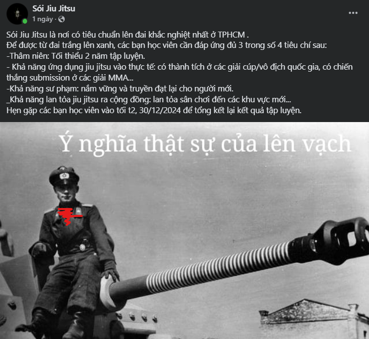
:::

::: {.callout-note title="12.23.2024 | Compressing the techniques" collapse="true"}
Trong khoản gần 2 tháng thực hiện các ghi chú vừa rồi, rất rất nhiều các tiểu tiết kỹ thuật được truyền đạt. Thường xuyên thực hành, chăm chỉ tập luyện gần như là cách duy nhất để ghi nhớ các kỹ thuật, tư duy đó vào *cơ bắp* của chúng ta. Tuy nhiên, một bổ trợ cũng thường xuyên được sử dụng, chính là đơn giản hóa những nguyên tắc cốt lõi nhất thành các câu lệnh có điều kiện đơn giản, nén chúng lại vừa đủ để cache vào short term memory của chúng ta.

Vì thế mà ở lò Sói thường xuất hiện các cụm từ như: "*xem đồng hồ*", "*nghe điện thoại*", "*ôm trán*", hay "*nếu nhìn thấy ..., thì ...*". Một trong số đó là: "*nếu nhìn thấy khuỷu tay và cổ tay đối phương ở trước mặt - ngang hai mắt, không đánh nó là một điều tội lỗi*".

Hai tuần nay tập luyện vẫn là bài đánh chân từ bottom + kiểm soát và tiến tới kimura một cách có hiệu quả. Chân chính là chi đầu tiên engage với đối thủ, kiểm soát được chân (cố định được một khớp như đầu gối, hay làm xoắn nó) là mục tiêu đầu tiên cần đạt được để làm đối thủ bận rộn, kiếm thêm thời gian và bảo toàn thể lực.

Đánh kimura trong thực tế cũng sẽ không đơn giản như chỉ cần chồm lên, hai tay kết nối được thành cái **vì kèo** (4-shape - thứ có thể dễ dàng quan sát trên phần mái tôn của nhà thi đấu Nguyễn Tri Phương) là xong. Mà là quá trình từ grip đúng cách (vào cổ tay), kiểm soát được đầu kia của trục tay (vai), tạo áp lực vào khuỷu tay (giống như armbar), khiến cho đối thủ đưa tay cho chúng ta kimura trong lúc scramble. Luôn tạo một áp lực nhất định, bắt đối thủ chọn 1 trong hai phương án đều bất lợi, dần dà sẽ làm cho họ đưa tới cho ta một vị trí có lợi hơn.

> Chúng ta không dùng sức để lấy được một vị trí thuận lợi, chúng ta tạo áp lực đúng cách để khiến đối thủ đưa vị trí đó cho chúng ta - Vũ Đình Tiến (*đại ý*).

Nghe giống như một mental model mà mình từng đọc qua - [dilemma](https://www.bjjmentalmodels.com/dilemma).

 
 
Oss! Ghi chú được ghi lại sau 2 ngày tập - ngày 25, đúng là:

> Thời gian không ngừng, chỉ có con người mới ~~lười~~ ngừng - Thong Le.
:::

::: {.callout-note title="12.15.2024 | My 2nd open mat" collapse="true"}
After 9 months of training, I finally had my 2nd open mat at Soi Jiu-jitsu :). Rolling with the real heavy hitters at the first time made me think that this open mat not suit for me. But anw I had a free Sunday morning this week so I decided to try again.

Did better this time, rolled with a skillful 7xKG and had to bear his weight most of the time but still I held out until the end. I just rolled for one round, since I've been practicing for 4 days in a row, and have got a shoulder injury. Let's improve next time!

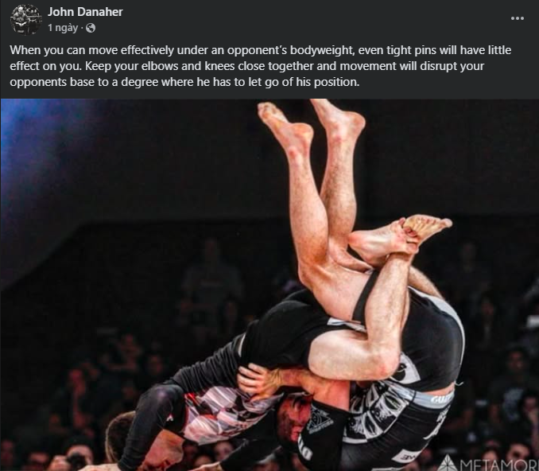
:::

::: {.callout-note title="12.09.2024 | Week of Americana" collapse="true"}
> Theme of the class this week is to master the Americana.

The head coach continued with the final bonus of how to do Americana the right way at his Seminar "Bottom game for dummy" at the ACE community hosted by Saigon Saga, teaching Americana in various positions.

Remember weekend's lesson of bottom game, you'll have good position for **a sweep** or **a triangle**. But before jump into finishing triangle, let's explore some americana/straight armbar variants. Opponent will be trying to posture up to prevent triangle choke and escape, their arm will be around your hip, *use your 2 hands to grip/hook into their armpits to control the distance* - arms to pull, legs to push.

1.  If their **inside elbows** expose to your eyes, you can go for a straight armbar;
2.  If not, you can see their **outside elbow**, go hook, pull them out of the body and overhook -\> kimura;
3.  If they move elbow to inside body, you can **bury their elbows to our pelvis**, using the thrust to create a fulcrum, keep pushing and rotating their hands to outside. This is a variant of Americana;
4.  Finally, none of above work, you can go a triangle choke, but to concrete the technique: you can creat 2 layer circle that threat the opponent's neck. The first one is traditional leg position (1 arm and the neck), the second one is **underhook the remaining arm, circle over the head**. The choke thus would be more efficient!

I have some more rounds rolling with Gi/Kimono today with anh Tu & anh Thong, pretty cool (but literally hot in the Gi). I've taught some basics of gi fighting: how to grip properly and legally, how to generating force, esp. in a pulling action.

Final quote of the day:

> Let's start to think about the game plan! - Thong Le
:::

::: {.callout-note title="12.08.2024 | Vu Dinh Tien Seminar" collapse="true"}
# **Bottom games for dummies**

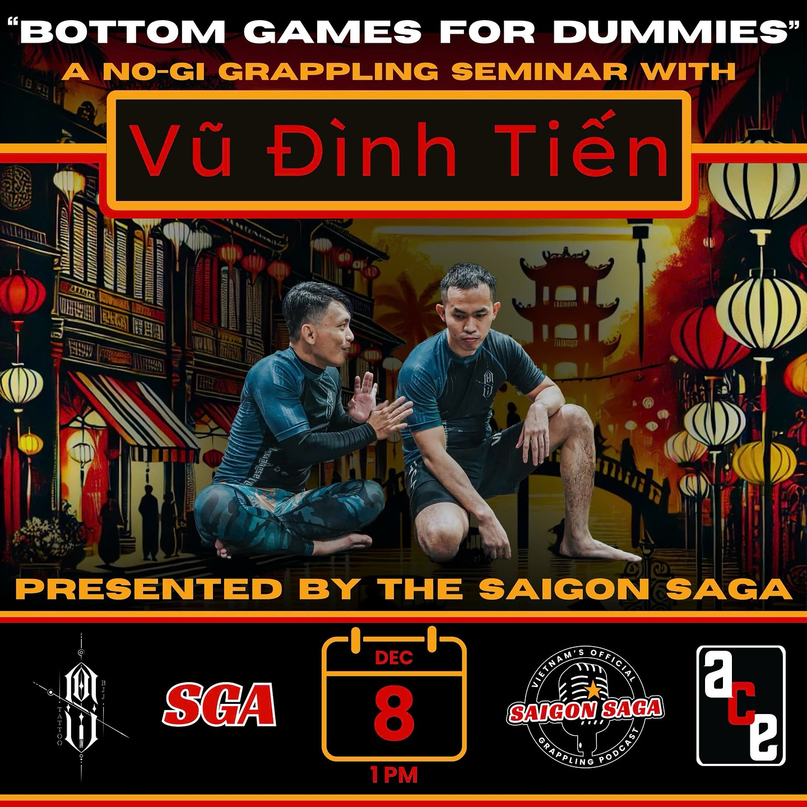{width="60%" fig-alt="Seminar's Banner" fig-align="center"}

Let's forget everything about BJJ before this class.

### Phase 1: getting contact

1.  Control the lower body of the opponent: 6 control points, block with feet or hook with instep;
2.  When 1 leg of the opponent pass your hip, hands to engage;
3.  End up with closed guard or half guard or k-guard.

### Phase 2: contacting

When contacting, we want to control at least 1 leg & 1 arm (upper body), both in 1 side is preferable - like hinge shaft of the door. So that we can flip it to sweep.

There are many ways to control upper body, as said in notes before. How we attack the leg is also mentioned in this journal.

### Phase 3: loosing control & transitioning

Opponent certainly does not want to be passive in the game, they want to post up/scramble/initiate frame, etc ... to get out or our control. The matter here is we should be aware of this and prepared. We can exploit the opponent's traction force to sit up, creating a shin to shin position or transitioning to leg attack like k-guard.

The keys in bottom game I thinks is **distance control**, **tracking their movement**, **keeping disturbing their comfort**, **get proper wedge, hook**.

### Q&A

> Q1 - Huan: If the opponent hides their heels, how can we hook in and flare it?
>
> A - Soi: No one can dominate in every direction, when they hide feet in their butts, they can be easily pushed back. We can sit up and push.

> Q2 - Stranger: how do we not let opponents hand-cross our heads when they try to pass our guard?
>
> A - Soi: Put your palm on you forehead - just like you're striking - creating a frame. The opponent's hand just can only slip through it. Their armpit reveals and you'll have chance to underhook with remaining arm, and even finish with straight arm lock.

### Bonus - Americana the right way:

1.  Use your wrist as a blocking wedge instead of hand grip. It will leverage the lock and create discomfort for the opponent.
2.  We dont want to push their elbow up, because:
    -   as long we push it up, we loose the pressure we made in chest to chest;
    -   elbow up is a natural movement to ease the pressure we made. so we need to pin the elbow on the mat - **use your head**, with the wedging above you'll finish the Americana.

Happy learning!
:::

::: {.callout-note title="12.06.2024 | Deep half" collapse="true"}
Buổi học được dẫn dắt bởi Huân, tiếp nối chủ đề hôm trước từ bottom - half guard -\> under hook tay -\> hook lưng -\> sweep.

Nhưng hôm nay tiếp cận theo hướng ngược lại -\> "lao vào lòng" đối thủ và hook sâu xuống chân/Deep Half.

Từ đây có thể mở ra nhiều cơ hội tấn công, ít nhất hai hướng sweep tùy theo body movement của đối thủ.
:::

## **November**

::: {.callout-note title="11.29.2024 | Put constant pressure on your opponent" collapse="true"}
> Ta phải đánh đổi giữa sự linh hoạt (flexibility) của bản thân và áp lực (pressure) lên người đối thủ.

Hôm nay tập hand fighting và làm quen kiểm soát tay từ butterfly guard (bottom), hai thứ quan trọng cần nhớ vẫn là:

1.  Tác dụng lực vào tay theo trục vuông góc với mắt - cơ thể hai đấu thủ;
2.  Cố gắng đưa khuỷu tay ra xa.

Arm lock có thể dùng là *outside overhook với 4-shape hand grip*, *inside overhook* (mình hiểu outside nghĩa là body mình nằm ngoài trục cơ thể đối phương và ngược lại cho inside), hoặc *underhook với cách-khóa-giống-rnc*. Hãy học các linh hoạt switch giữa các kiểu control này.

Cuối cùng thì 1 dạng omoplata với hai-tay-grip-vào-nhau. Việc hai tay luân phiên kiểm soát được phần vai + tay của đối phương (**luôn có áp lực**) trước khi đạt được grip là thứ thú vị nhất hôm nay. Đòn này cũng có thể kết thúc bằng triangle and/or armbar.

Oss!
:::

::: {.callout-note title="11.27.2024 | Some details to focus" collapse="true"}
Hình như từ lúc ghi cái nhật ký này thì tần suất đi tập bị thưa đi thì phải =))))

Hôm này, sau một tuần về Nghệ An, mình tập lại và vẫn là bài thực hành kiểm soát khoảng cách, chuyển đổi phương án tấn công.

-   Có 1 điểm mới là tại trạng thái sắp lost contact, với hand grip ta có thể áp dụng việc ngồi lên -\> **shin to shin** -\> ankle pick -\> **single leg takedown**;
-   Sf có nói thêm về cách thoát khi bị single leg takedown: *cần đưa đầu của đối thủ ra khỏi centre line của mình*, dùng tay đưa vào phần cổ của đối thủ để tạo không gian cho hông mình thoát ra, tay đó cũng sẽ là tay lock anaconda -\> drag đối thủ xuống và chiếm lấy vị trí có lợi;
-   Bonus 1 - Thong Le: triangle - armbar ở tư thế mình ở bottom / mount khác với thông thường, mình sẽ không lock 2 chân lại. Hãy dùng gót / heel của chân nằm dười làm **blocking wedge / nêm chặn** để giữ shin chân trên, rất linh động và dễ thực hiện, dễ siết;
-   Bonus 2 - Huy + Thong Le: pass guard để ý tay và chân, khép tay lại. Khi pass cái tay nằm dưới của đối thủ là thứ ta cần kiểm soát. Hãy học cách dùng trọng lượng thay vì sức lực. Không move around nhiều mà đưa một chân ngay vào centre line của đối thủ.

 rất hay từ Lachlan Giles](img/20241128_single_leg_takedown){width="100%" fig-alt="Single leg takedown" fig-align="center"}
:::

::: {.callout-note title="11.16.2024 | Distance control and matter of inside or outside" collapse="true"}
Khẩu quyết đầu ngày:

> Một đối thủ với base vững chắc, co cụm và gồng cứng sẽ ít cho ta cơ hội để thực hiện một đòn thế. Ta cần quấy rối, "làm mềm" để từ từ mở ra cơ hội tấn công / kết thúc. ---------- *đại ý, không phải nguyên văn từ coach*

80% (số-này-được-mình-bịa-ra) thời gian của một game đấu là thời gian hai đấu thủ tìm kiếm một vị trí thuận lợi / setup được position cho các đòn thế được giảng dạy trong hầu hết các giáo trình BJJ. Việc giảng dạy kiểu technique-based rất có lợi trong các khoảnh khắc quyết định, tuy nhiên đường đi đến các khoảnh khắc đó - tức đa số thời gian thi đấu - cũng không kém phần quan trọng. Bản thân mình cũng rất loay hoay, bối rối khi học được một vài kỹ thuật khóa siết, kiểm soát nhưng thực tế không thể tiến tới được. Như mọi bài giảng khác, hôm nay head coach lại nói về cách tiếp cận để kiểm soát body đối phương, limbs motion và positioning mindset.

Tiếp tục về chủ đề control the game ở note trước, từ vị trí bottom, thầy cho ghi nhớ và làm quen các move ở hai yếu tố sau - nhằm học cách **kiểm soát khoảng cách với đối thủ và có các hành động tương ứng**:

-   **Phần thân dưới**:
    -   khi đầu gối đối phương chạm chất, ta ưu tiên tấn công từ phía ngoài: closed guard -\> ankle hook -\> leg sprawl. Vì lẽ nó còn cho phép ta giữ cho đối thủ không chạy đi bằng việc móc chân giữ lại;
    -   khi đối phương chống chân lên, gối nhấc lên, ta mất cả năng outside hook, ta ưu tiên chuyển qua inside hook hoặc wedge;
-   **Phần thân trên**, song song với thân dưới, ta cũng cần kết hợp giữ tay - vai - đầu của đối thủ:
    -   ta muốn đưa ít nhất một tay của họ khỏi được central line ra *bên ngoài* hoặc *bên trong*;
    -   ta muốn chỏ của họ ra xa khỏi lườn, có thể bắt đầu từ việc 2-đánh-1 vào cổ tay, kéo/đẩy nó theo phương vuông góc với body line của 2 người;
    -   từ đó có thể đạt được 1 grip kimura (in/out) với 4-shape, hoặc overhook/cross underhook với tay còn lại ghì đầu/cổ đối thủ xuống.

Ta cần làm quen với việc kết hợp cả tay và chân từ khoảng cách gần nhất - closed guard, tới xa nhất là hand wrist grip -\> transition sang đánh chân như **chuỗi tấn công** đã nhắc ở note trước. Nếu làm đúng, đối thủ sẽ tiêu hao rất nhiều sức lực để thoát ra, đó là một số nguyên lý cần ghi nhớ khi ở vị trí bottom.

Tất nhiên cũng có ngoại lệ, như:

-   Butterfly guard với double underhook là một inside attack khi đối thủ base hai đầu gối (tuy nhiên mình chỉ có thể dùng lực chân để nâng đối thủ lên chứ ko thể hook -\> sprawl đối thủ ra được, trong MMA hoặc street fight, đối thủ có thể chỏ vào đầu nếu mình dùng đòn này);
-   De la Riva cũng có thể coi là một inside (khi hông của mình nằm giữa chân). Tuy nhiên fact là chân thầy bị xoắn khi thực hiện nên lò Sói không dạy đòn này, reversed De la Riva - dễ thực hiện hơn - có thể sẽ được giảng dạy trong tương lai.

{width="50%" fig-alt="Yin Yang/阴阳" fig-align="center"}

Bonus quote 2:

> Trong Jiu Jitsu, mình - cũng như đối thủ - sẽ cố gắng "dán" các đường chéo lên/cắt ngang người đối phương. **Càng nhiều** đường chéo được tạo ta, ta **càng** kiểm soát đối thủ tốt hơn.

Bonus quote 3:

> Mục tiêu của các bạn khi drill/roll ở lò này không phải là submit bạn tập, mà là **kiểm soát** họ.

Oss!
:::

::: {.callout-note title="11.08.2024 | Control the game from bottom" collapse="true"}
> Nếu bạn có một gameplan đánh chân đủ tốt, bạn sẽ luôn chủ động trong mọi cuộc đấu.
>
> ---------- Vũ Đình Tiến (*không hẳn là nguyên văn, là đại ý mà mình nhớ được*)

Mình nhớ trong một rolling session, Lâm Đoàn đã nói chân là thứ rất quan trọng nếu muốn kiểm soát trận đấu. Đối thủ chỉ cần ôm lấy đùi bạn từ vị trí top và giữ được nó, họ gần như sẽ chiến thắng trận đấu, ta rất khó để tiến tới một vị trí có lợi hơn khi mà chân bị khóa cứng.

Luôn có lựa chọn để đánh chân khi ta ở bottom (ví dụ half/closed guard), hôm nay Thầy cho drill mấy điểm sau:

1.  Khi hai đầu gối của đối phương **base** dưới đất (trọng tâm dồn vào đấy) -\> ta có thể dùng chân hook vào phần mu cổ chân và kéo dãn chân, phá cái base đó đi;
2.  Phản ứng tự nhiên là họ sẽ cố xây lại base bằng cách chống chân -\> ta có thể **hook** vào phần trong đùi, hoặc **wedge** (nêm chặn) vào hông của đối thủ;
3.  Trong các tình huống trên, hãy luôn cố gắng kiểm soát phần trên bằng tay: *có thể là over hook + ghì đầu đối thủ, có thể là under hook tay nghịch, over hook với 4-shape, thậm chí tệ nhất là wrist grip*. Hãy học cách kết hợp tay và các hook chân để kiểm soát cơ thể đối phương;
4.  Rồi giờ hãy để ý, *nếu ta thực hiện được điều 3*, vị trí đối phương sẽ luôn trong tầm tấn công. Đặc biệt, khi stand up, *chân của đối phương sẽ luôn expose để ta thực hiện 1 đòn grip chân*;
5.  Như vậy ta có thể tạo ra một **chuỗi tấn công**: **Gối chạm đất** -\> hook chân sprawl ra -\> hook đùi trong hoặc wedge vào hip -\> **đối phương stand up** -\> triển khai single leg X, X-guard sweep, K-guard (đánh được triangle, omoplata, hay reversed closed guard) -\> nếu đối phương có thể thoát được, **khả năng cao gối của đối phương sẽ lại chạm đất**, ta lại bắt đầu lại.

Oss!

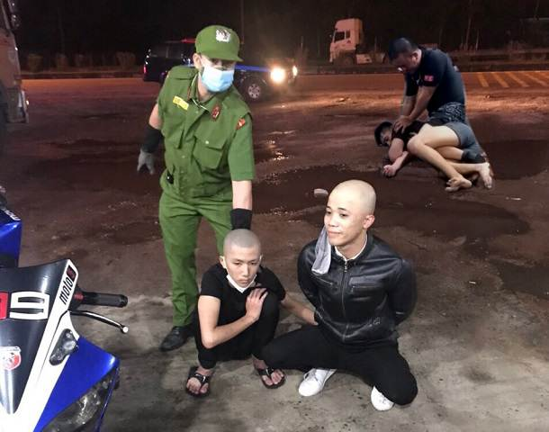{fig-alt="Ảnh không liên quan, congandanhdan by Minh Tân" fig-align="left"}
:::

::: {.callout-note title="11.02.2024 | Saturday guard passing" collapse="true"}
Hôm nay mình học pass guard từ một vị trí open - cụ thể là half guard - hoặc tương tự thế, chúng ta thường tiếp cận bằng cách đưa một chân vào vùng hai chân của đối thủ.

Cần ghi nhớ:

-   Khi guard mở, hai chân của đối phương nâng lên defense sẽ làm giảm tính linh hoạt, giờ họ chỉ di chuyển bằng hông;
-   Ngay cả khi set up được guard, việc khống chế sao cho bàn chân của đối phương bị nhấc lên cũng sẽ hạn chế khả năng dùng lực chân của họ;
-   Chúng ta sẽ cần pin được 1 đầu gối (như hình, của chân `c1`), và kiểm soát tay nằm chéo chiếc chân này, khống chế cơ thể của đối phương bằng một đường chéo (màu xanh lá như hình).

Tất nhiên chân `c2` của họ sẽ shield lại ngăn cản. Chúng ta có thể tấn công theo hướng này (đường xanh lá) - đùng đầu và lườn hook/đẩy vào dưới cánh tay - sẽ tiêu hao rất nhiều sức lực, và cũng nên cẩn thận việc bị neck crank. Trong quá trình đó ta vẫn cần kiểm soát chân `c1`, cố gắng gạt chân `c2` ra.

Hoặc chúng ta có thể lựa chọn tấn công theo đường *màu tím - ngang thân*. Ta cần làm được:

1.  Kiểm soát chân `c1` bằng hai chân của mình, cố gắng nâng bàn chân đó lên khỏi mặt đất - có thể bằng cách móc hai chân mình lại với nhau, sau đó duỗi ra trong khi đang *ngồi lên chiếc gối đó*. Việc này cũng sẽ hạn chế việc chân `c2` khi bị gỡ shield sẽ quay sang tấn công chân trong của mình;
2.  **Cố định hông của đối thủ**, do ta đã pin được chân `c1`, thế nên nếu kiểm soát được chân `c2` tự nhiên hông của họ sẽ không di chuyển được. Đầu tiên hãy *xoay trục cơ thể về đường tím*, sau đó ta có hai hướng:
    -   a\) Đẩy chân `c2` - phần gối về hướng `h1`, hãy dùng khối lượng cơ thể bằng cách kết hợp việc duỗi chân ra. Đối phương sẽ tiêu hao nhiều sức lực hơn và khi pass được đầu gối `c2`, ta có thể pivot/xoay trục về đường xanh lá để đánh tay;
    -   b\) Đẩy chân `c2` - phần gối về hướng `h2`, ta có thể hook tay phải vào sau chiếc gối này và đấm tay xuống đất (trước bụng đối phương) - lúc này hông của họ cũng không di chuyển được. Sau khi đè được gối `c2` xuống, ta có thể:
        -   i\) pass kiểu knee slice về phía trước; hoặc
        -   ii\) duỗi người, thẳng chân, di chuyển bằng mũi ngón chân để pass về phía sau - giữ cho trọng lượng cơ thể vẫn áp lực lên người đối thủ.

**Bonus**: Đòn đánh `2.b.ii` có thể kết thúc bằng outside heel hook, khi mà chân `c2` đã ở trong hông, tay phải mình cũng sẽ đang - một cách tự nhiên - giữ lấy nó.

**Nói tóm lại**, các tư duy cần ghi nhớ sau buổi học này:

-   Không nên dùng sức mà nên dựa nhiều vào trọng lượng cơ thể;

-   Không tấn công được theo hướng này thì nên pivot ra hướng khác, không ai có thể mạnh trên mọi hướng (-- said Tiến Sói 🐺);

-   Hông / hip là một phần quan trọng trong việc trực tiếp maintain **posture**, gián tiếp ảnh hưởng tới khả năng trụ chân để maintain **base**, cũng như sự tự do của tay chân để maintain **structure**, ba yếu tố trong [**alignment**](https://lktuan.github.io/blog/2024-08-06-bjj-mental-models/#theory-of-alignment) của bạn 👊.

](img/20241102_guard_passing.png){width="100%"}

Kết thúc, một buổi chiều quá nóng, may có ly nước mía!
:::